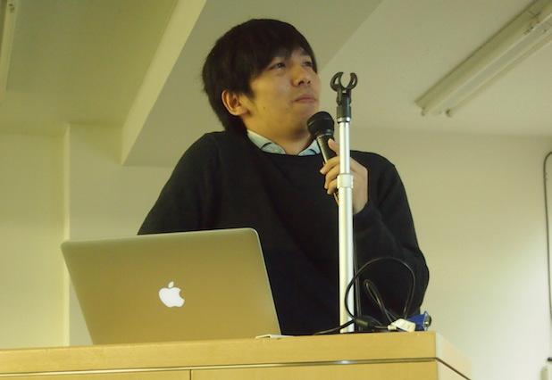
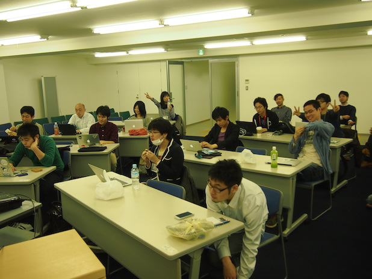
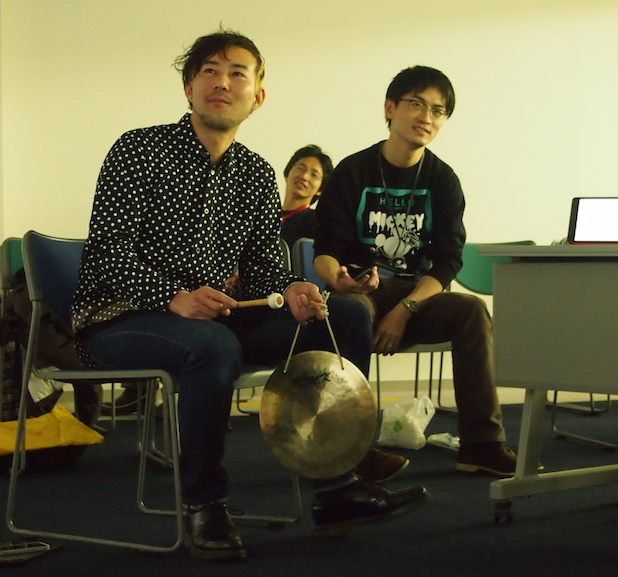
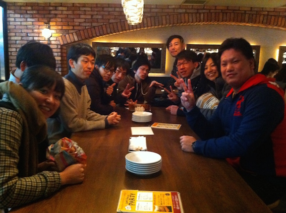

# よちよち.rb 第50回 みんなで LT デビューしよう会

はじめまして、よちよち.rbのドアラ将軍こと大塚（@ohtsuka\_t）です。

去る2014年12月20日、よちよち.rbの2014年最後、記念すべき第50回のミートアップ**「みんなでLTデビューをしよう会（経験が既にあるかたは更なる経験値アップをしよう会）」**に参加しました。

LTに慣れること、そして人前で話すことに慣れよう！ということを目的としています。

## よちよち.rbとは？

よちよち.rbとは、2013年11月に産声を上げた（先日無事に一周年を迎えました！）、 @yucao24hours さん主催の**初心者の、初心者による、初心者のための Ruby on Rails4.0 勉強会（読書会）** です。**目線の高さが同じ人といっしょにひとつの活動を根気よく続けることで自信をつけていくこと**を最大の目標としています。

主な活動内容ですが、週一度のミートアップ（[Ruby on Rails チュートリアル](http://railstutorial.jp/) の読み合わせ）を中心に、オンライン読書会、不定期開催の飲み会、開発合宿、今回のLT大会といったイベントを開催しています。

詳しくは [こちら](https://github.com/yochiyochirb/meetups#%E3%82%88%E3%81%A1%E3%82%88%E3%81%A1rb%E3%81%A8%E3%81%AF) を御覧ください。

私事ですが、2014年3月からよちよち.rbに参加させて頂いています。初のコミュニティ参加ということもあり不安でいっぱいでしたが、快く迎え入れていただき、今では素晴らしいメンバーたちと楽しく活動させて頂いております。コミュニティに参加してみたいけど不安だな...という方はぜひ一度参加してみてはいかがでしょうか！

## スライド作り

初のLTということで、発表はもちろん、スライド作りも初めてです。  

LT開催までの期間、twitter上では「アカン、まだ1枚もできてへん...」「絶対に5分以内に収まらないんですが」「よっしゃ、タイトルだけできたやで！」「なんで私が一番に発表なの〜〜」などなど、発表を控えたよちよちメンバーの阿鼻叫喚が聞こえるようでした。  

そしてこの様相は発表前日（当日も？）まで続きました...

そしてLT大会当日...

## LTスタート！

株式会社キャリアデザインセンターさんを会場に（@bonbon\_0605 さん会場係ありがとうございました！）、発表者・聴者総勢25名ほど集まり、LTに欠かせないドラもバッチリ用意して、トップバッターで緊張の面持ちの @umekumi さんの発表よりLT大会がスタートしました！  

LTのテーマは**「2014年のふりかえり」**でした。

初心者だからといって、時間オーバーは許されません。ドラ係（通称：銅鑼マー）により容赦なく終了のドラが鳴らされます。

制限時間と戦い爆速でしゃべり続けた者、アプリのデモを交えながら話した者、美しい姉弟愛の話をした者、フォアボールの話をした者、実は剣士だった者、、、などなど色々な人がいて様々な話が聞けました。  

内容もさることながら、皆の発表が初めてとは思えないほどクオリティが高く、しかもほとんどの人がしっかりと話を制限時間以内に収めていたということ（残念ながら途中でドラがなってしまった人も、後々話を聞いてみると残りのスライドは2,3枚だったとか。惜しい！）がとても素晴らしかったです。

詳しいタイムテーブルは [こちら](http://yochiyochirb.doorkeeper.jp/events/17898) を、また当日のライブ感を味わいたい方は [togetter](http://togetter.com/li/759800) を御覧ください。

### こんな発表がありました

ここで、数名の発表を抜粋して簡単に紹介させていただきたいと思います。  
私の独断で、[よちよち.rb Advent Calendar 2014](http://www.adventar.org/calendars/582) で @odailly\_jp さんに書いていただいたブログ [Yochiyochi Committers Who's Who in 2014](http://shindolog.hatenablog.com/entry/2014/12/02/235913) で紹介していただいた面々を中心に発表を紹介させていただきたいと思います。（紹介できなかった皆様すみませんm(\_ \_)m）

（ @umekumi さんのレポートは @odailly\_jp さんに書いていただきました。ありがとうございました！）

---

#### 今年のWebデザインにまつわるアレコレ / @umekumi

よちよち.rbが始まった頃から参加されているデザイナーの@umekumiさんは、2014年のWebデザインにまつわる出来事の中で、特に興味を持たれたことを発表されました。

**2014年の出来事**

@umekumiさんは、2014年のWebデザインにまつわる出来事として、次の3つを語られました。

- HTML5が正式勧告

- SVGが使われているWebサービスがあることを知った

- BPGを知った

**HTML5**

Web界隈で話題になっていたHTML5が、ついに正式勧告されました。
今までFlashなどに頼っていた部分をHTMLで実装できるようになるそうですので、2015年はHTML5を利用したいですね。

**SVG**

SVGはXMLをベースとして作られた画像フォーマットだそうです。
pplogやesa.ioといったWebサービスでSVGが使われていることに気付いた@umekumiさんは、「これからはSVGを使っていきます！」と熱く語られていました。

**BPG**

BPGはJPEGに代わる新しい画像フォーマットだそうです。
BPGはファイルサイズや画像の品質がJPEGより良いらしいですが、Adobeが対応してくれるかが気になるところです。

@umekumiさんの今回のLT大会のトップバッターでしたが、素晴らしい内容のLTに参加者は驚かされました。
2015年の@umekumiさんの活躍が楽しみですね。

[関連ブログ](http://umekumi.hatenablog.com/entry/20141222/1419213551)

---

#### [よちよちと歩んだ2014年](http://www.slideshare.net/pupupopo88/walked-with-yochiyochirb) / @pupupopo88

「ゼロコンマ1秒の戦いなので…」そう言って壇上に上がった @pupupopo88 さんは、その言葉通りの弾丸トークで会場の爆笑を誘い、以降の発表者のハードルを上げて壇上を去っていったのでした…

\-\-\-\-\-

第0回から今日に至るまでのよちよち.rb、そしてご自身の歩みを発表されました。

**よちよち.rbの歩み**

よちよち.rbの第0回から今回のLT大会までの活動内容をとても詳しく紹介していただきました。

**@pupupopo88 さんの歩み**

参加当初は「みんな全然初心者じゃないよ…」という心境だったのですが、参加を続けていくうちに少しずつ自信がついてきました。と同時に、よちよちメンバーのストイックさに驚き、自分が熱意を持って取り組めることはなんだろうということを考え始めました。

考えた結果、自分が受けた良い影響を自分の中にとどめておくのではなく、それを周りにも広めたいということに気づきました。

具体的にはRESTful勉強会/社内勉強会のお手伝いや、後輩を連れてよちよち.rbに参加されたりしています。

よちよち.rbに通い続けて少しストイックになれたので、これからは参加するだけでなく提供する側にも回りたいということを話されていました。

[関連ブログ](http://pupupopo88.hatenablog.com/entries/2014/12/23) を見てみると、このLT資料を作ったことで自分の考えも整理できたようですね。 

---

#### やりたいことをやるために / @talkto\_me

やりたいことをやるために、この1年どのような活動を行ってきたかということを話されました。

**2014年の目標**

今年は引っ越すぞ！ということで2014年をスタートさせた @talkto\_me さんでしたが…

2014/1 : 家探し始める  
2014/2 : 引越しました

早々に達成！…しちゃいました＼(^o^)／

**次は何をしようか...**

と悩んでいたところ、積ん読していた「7つの言語 7つの世界」を読んでRubyと出会い「なんか面白そう！プログラミングしてみたい！」と考えるようになりました。

でも一人で勉強するのはちょっと大変かも…

ということで

**よちよち.rbに参加！**

勉強会初参加ということもありとても緊張していましたが、会場に向かう途中に @altarf8（通称：部長）さんに色々聞いて、面白そうな予感がしてきました…！

参加した結果…ヤバい！楽しかった！

その後もっと開発をしたいと考えるようになり、そのために今までどのような行動をとってきたかというお話と、その良かったことや反省点を話されていました。

[関連ブログ](http://jangajan.com/blog/2014/12/12/reviewing-2014/)

---

#### 珍記録2014 / @ohtsuka\_t

それがしは不覚にも [よちよち.rb Advent Calendar 2014](http://www.adventar.org/calendars/582) の [記事](http://t-ohtsuka.hatenablog.com/entry/2014/12/06/083841) でこの一年を振り返ってしまったため、野球の話をしました。

エンジニアとしてまず一芸を極めて見るのはいかがであろうかということで、今回はテーマをフォアボールに絞って話しました。

**フォアボール（四球）とは**

ピッチャーがボール球を4球投げること。

ペナルティとしてバッターが一塁に歩かせてしまいます。

バッターが一塁に行けるという点で考えると、ヒットを打ってもフォアボールを選んでも結果としては同じなので、ヒット≒フォアボールということが言えます。

ヒットを打たれるということは相手バッターを褒めることもできるのですが、フォアボールは完全にピッチャーのミスなので、フォアボールを出してしまうことは、ヒットを打たれることよりもピッチャーにかかる精神的ダメージは大きいと言えます。

書籍「マネーボール」または「WEB+DB PRESS vol.84」の「特集③メジャーリーグのデータで学ぶ[速習]統計分析」を読んでいただくと、フォアボールに関しての知見が得られるかもしれません。

**注目選手**

アンドリュー・ジョーンズ（東北楽天ゴールデンイーグルス）

2014年度のパ・リーグで一番フォアボールが多かった選手です。フォアボールを極めた選手であると言えます。

打率（ヒットを打つ確率）はリーグ最下位だったのですが、そのフォアボールの多さから出塁率（塁に出る確率）はリーグ3位に跳ね上がるというかなり癖のある選手です。

アンドリュー・ジョーンズのように何か一芸を極めて見るのもエンジニアとして役に立つのではないかというお話でした。

---

#### 今年に作ったもの / @odailly\_jp

「[ことばの探索機](http://kototan.info/)」というwebアプリを中心に、今年作ったアプリの一部を紹介していただきました。

**2014年に作ったもの(一部)**

* shinji … 新漢字と旧漢字を相互変換するGem
* hubot-github-comments-notifier … GithubのPRにコメントが付いた時に通知を送るHubotプラグイン
* ittemi … 「あそこに行くついでに、寄ったほうがいい場所を教えてもらおう!」というWebサービス

**ことばの探索機**

簡単に説明させていただくと、文字を選択するごとに「一つ前に選択した文字で始まり、今回選択した文字で終わる言葉」を表示してくれるアプリです。

2014年11月に開催された、よちよち.rbの開発合宿で開発されました。

**何故このアプリを作ったの？**

「[ワードバスケット](http://jaga-tokyo.com/wordbasket/)」というカードゲーム（ざっくり説明すると「場に置かれているカードの文字」で始まり「手札のカードの文字」で終わる単語を言って、そのカードを場に出す。ということを繰り返すしりとりゲーム）をするときに「ヒントを与えてくれるようなものを作りたい」ということで作成されました。

発表の終わりも「ことばの探索機」を使って「おしまい」と表示させるという粋な演出をしていただきました。

---

#### [よちよち.rbに１年通ったら、エンジニアになれました（仮）](http://www.slideshare.net/mobile/riekato7796/become-a-progrmmer-taking-part-in-yochiyochirb) / @katorie

よちよち.rbに1年通った結果プログラマになることができた @katorie さんの活動内容を発表されました。

**プログラマになりたかった**

学生時代・社会人時代を通してプログラミングとは縁のない生活が続いていました。しかし、皆が悩んでいる問題点などを技術で解決できるということは素晴らしく、そのような技術や知識を活かした仕事への憧れを抱くようになりました。そして、なによりプログラミングが楽しい！ということからプログラマになりたいと思うようになりました。

**活動内容**

* 2012年
 * Rubyをさわり始めました。この年は一人で色々Rubyをいじっており、写経したり、Twitter botを作ったり、仕事を楽にするスクリプトを書いてみたりしていました。
* 2013年
 * RailsGirlsTokyo 2nd で勉強会デビューをしました。他にも、RubyKaigi 2013、RailsGirlsTokyo, more!などの勉強会への参加や「パーフェクトRuby」を読んだり、Railsの本を写経してみたりという活動も継続して行っていました。

**2013/11 よちよち.rb 始動！**

第0回からよちよち.rbに参加されている @katorie さんが、よちよち.rbで得られたもの
* Railsやその周辺の知識、技術
* 同じ目線の仲間 → 高いモチベーションを保つことができる
* 知らない・分からないことを聞く勇気
* 継続していくことの大切さ

**楽しいことは大切**

楽しいと感じることは続けることができるし、続けていくと点と点が線となり道になっていく

これからも楽しみながら続けよう！

[関連ブログ](http://d.hatena.ne.jp/katoriexxxkatorie/20141222/1419247215)

---

#### 2014年も終わり？いや…俺たちの戦いは…始まったばかりだッ！！！ / @highwide

@highwide さんは2014年、_motivation_ と戦っていました..

今までは何かやるときに、開始直後と締め切り直前以外はやる気が無くなってしまっていたが、2014年はRubyもバリバリ書くし、ブログもバリバリ書くんや！と意識高いエントリを書き、やる気いっぱいのスタートを切りました！

そんな @highwide さんの2014年ブログ件数がこちらです！

* 2014 (6)  
 * 2014 / 12 (2)  
 * 2014 / 9 (2)  
 * 2014 / 1 (2)

あ、あれ？？

このままでは今までの二の舞いに...

しかし2014年はこれでは終わりませんでした！

5月くらいに「一人でモチベーションの維持は難しい。勉強会を探そう！」という風に考え方を方向転換しました。

そこでよちよち.rbに参加して、すごく楽しく、やる気をもらうことができました！

そして「モチベーションを維持するのに一番いいのは、周りにモチベーション高い人がいる状態を作ることじゃね?」ということに気づきました。

そして、モチベーションが高いときにやるべきことは、「モチベーションを維持できる環境に身を置く、またはそのような環境を作る」こと、という教訓を得ることができました。

そして、今後もモチベーションを維持できる環境で頑張って行きたいという発表をされていました。

俺たちの戦いは…始まったばかりだッ！！！（ご愛読ありがとうございました。@highwide 先生の次回作にご期待下さい）

---

#### 俺とgemの成長記録 / @upinetree

鋭意執筆中

---

#### わたしはいかにしてRailsエンジニアになったか 〜転職活動編〜 / @yuki3738

(MEMO: タイトルにリンクを貼る)

60枚強のスライドを作成した @yuki3738 さんは @pupupopo88 さんに負けるとも劣らない超高速でspicyなLTを披露してくれました。

\-\-\-\-\-

@yuki3738 さんは一年半に渡るご自身の転職活動顛末記を話されました。

**転職活動開始**

2013年、仕事に楽しさを見いだせなくなっていたので、転職活動を開始しました。

そこで自分が何をやりたいかということを考えた結果…

Webサービスに出会うとワクワクする！  
自分でも役立つWebサービスを作りたい！  
おれ開発やりたかったんだよ！！！

やるかどうか迷ったが、憧れの気持ちが強く挑戦を決意！

**Rubyとの出会い**

そうと決まればプログラミングの勉強だ！といっても言語は色々ある…何が良いのだろう？

Rubyは日本人が作ったらしい、名前がいい、赤くてかっこいい

よし、Rubyだ！勉強だ！

入門書を手に取るが、ろくにプログラミング言語をさわったことないためすぐに壁に激突。

さらにやさしい本はないものかと探したところ「たのしい開発スタートアップRuby」に出会い感銘を受ける。

**よちよち.rbとの出会い**

気合を入れ直し勉強を進めるが、独りで寂しくなってきて仲間が欲しくなってくる  
→「たのしい開発スタートアップRuby」で知ったコミュニティに行ってみようかな

よちよち.rbの存在を知る  
→ Rubyを始めたばかりの俺にぴったりっぽい！行ってみよう！

楽しくてモチベーションアップ！

**救世主現る、そして転職成功！**

転職成功！しかしやらせてくれると言っていたRubyはやらせてもらえなかったため悩みに悩んだ末、転職活動を再開。

二度目の活動はなかなかうまくいかず、焦っている時に救世主 @igaiga555 さんに声をかけてもらう。

あれよあれよという間に選考が進み…

「お前のLifeをSpiceにしてやろうか！」

ということで spice life さんの一員となりました！

**まとめ**

現状に不満があるなら愚痴る前に色々行動してみよう！

あきらめないで動いてると見てくれてる人は見てくれてる or 誰かの目につく

**次回予告**

わたしはいかにしてRailsエンジニアになったか 〜実務編（仮）〜

お楽しみに！！

---

#### [エンジニアとして”はたらく”こと](http://www.slideshare.net/yucatoyucato/working-as-an-engineer) / @yucao24hours

満を持してのご登場、よちよち.rbの主催者の @yucao24hours さんの発表です。

英語とシックな写真をあしらったお洒落なスライドで、エンジニアとしてはたらくことの楽しさを伝える発表されました。

**エンジニアとしてはたらくことの楽しさ**

1. 仕事の時間（1日8時間）開発の世界に身を置けるということ  
つまり一日中コードを書いたり、ソフトウェア開発のことを考えることができます。
2. たくさんの仲間がいつも近くにいること  
同じエンジニアが身の回りにいるということは、一人で行き詰まってしまった時など質問をしやすい環境にあると言えます。
3. 便利な gem や開発向けサービス、ツールに出会う機会をたくさん持てること  
個人でアプリを作っている時にはなかなか使う機会がないような gem や、お客様によって色々なサービスやツールを使う機会があります。

**たくさんの人に知り合えること**

ひとつのプロジェクトはだいたい数ヶ月程度なので、短い期間にホントにたくさんの人と知り合える機会があります。  
出会いがあるということはその分別れがあるということなのですが…  
ひとつひとつの出会いを大切にしたいと思います。

開発を仕事にするということは、必ずやあなたの技術力を磨き上げるための助けとなるはずです。

ENJOY YOUR ENTIRE LIFE WITH RUBY.

---

#### システムチームつくり / @bonbon\_0605

大トリは、会場係も務めていただいた @bonbon\_0605 さんです！

@bonbon\_0605 さんはご自身のお仕事の話の発表されました。

具体的にはチームが走りだすための基盤としてどのようなことを行い、どのような所感を得たか、そしてよちよち.rbについてのお話をされました。

**基盤作りおじさんの仕事のお話**

社内で新しいチームを立ち上げシステム開発を行うようになりました。

まだチームとしての歴史が浅いですが、競争力を高めるために開発の生産性を向上させる必要があります

そのための大きな問題点 → サービスやシステムについての知識不足・技術力不足

問題点を解決する必要がある

**基盤作りおじさんの仕事のチャンス！**

サービスに興味を持ち、楽しく働けるようにするために
* サービスに対する知識不足を補うために、週2回定期勉強会を実施  
* ノウハウの蓄積、コミュニケーションの活発化などのために
Idobata、Qiita:Teamなどのツールを使ってみる

**取組中の所感**

モチベーションは非常に大切で、生産性に大きな影響をおよぼす

文化を作ることは大変（例えばツールを入れるだけでは使ってくれないこともあるため「ツールを使う」という文化を作る。など）

「なぜ」を明確にすることの大切さ→「なぜ」が分かると色々な行動の原点になる

**よちよち.rbはすごい**

基本的に週一回会うだけなのに、多くの人が自発的に動き、
積極的に新たなチャレンジを行っている

「なぜ」このモチベーションが作られるのか

よちよち.rbのポリシー（以下に引用）を起点として
みんなが動けているためではないでしょうか

> この勉強会のいちばんの目的は、Railsを習得することではありません。目線の高さが同じ人といっしょにひとつの活動を根気よく続けることで自信をつけていくこと、これが最大の目標です。
> 
> 講師と生徒、のような形式はとらないつもりです。みんなで転んで、みんなで進んでいきます。
> 
> 効率よりも経過を重視します。2時間で1ページも進まなくても、その時間で考え実行したことが宝です。

よちよち.rbのような組織を目指して引き続きチーム作りを頑張ります

---

## ケーキ！

LTの合間の休憩タイムにケーキをいただきました！

元々「よちよち.rbの一周年祝にケーキを食べたいね」という話をしていたのですが（よちよち.rbは11/17日開催の第45回ミートアップで'ほぼ'一周年を迎えております！）、残念ながら実現できませんでした。

「一周年からは少し遅れたけど、LT大会で今度こそケーキを食べよう！」ということで、ケーキ班の @katorie さんに手配をしていただき、見事リベンジを果たすことができました！

RubyとMacBookと主催者である @yucao24hours さんのアイコンをあしらった素敵なケーキでした！

@yucao24hours さんにケーキ入刀をしていただき、美味しく頂きました！

次回のケーキ入刀はみんなのトラウマ nokogiri でやりましょう（ゲス顔）

## フリートーク

16時頃に全てのLTが終了し、それ以降の時間はフリートークが行われました。

LTの緊張から開放されてゆったりとした雰囲気の中、社内LT大会の再演、作ったアプリの紹介、セキュリティコンテストに行ってきたお話、tokyu.rbでの発表の再演などが行われました。

## おわりに

よちよち.rb初のLT大会は無事大成功を収めました！  
主催の @yucao24hours さんを始め、発表者・聞き手として参加した皆様お疲れ様でした！

